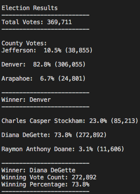

# Election Analysis

A Colorado Board of Elections employee has given me the following tasks to complete the election audit of a recent local congressional election.

1.  Calculate the total number of votes cast.
2.  Get a complete list of candidates who received votes.
3.  Calculate the total number of votes each candidate received.
4.  Calculate the percentage of votes each candidate won.
5.  Determine the winner of the election based on popular vote.
6.  Provide a breakdown of the number of votes and the % of total votes for each county in the precinct.
7.  Which county had the largest number of votes?

## Resources

- Data Source: election_results.csv
- Softward: Python 3.7.6, Visual Studio Code

## Summary
The analysis of the election shows that:
- There were 369,711 votes cast.  
- The candidates were:
    - Charles Casper Stockham
    - Diana Degette
    - Raymon Anthony Doane
- The candidates' results were:
    - CCS received 23% of the vote and 85,213 votes.
    - DD received 74% of the vote and 272,892 votes.
    - RAD received 3% of the vote and 11,606 votes.
- The winner of the election was: 
    - DD, who receieved 74% of the vote and 85k votes.  
- County results were as follows:
    - Jefferson: 10.5% of the total vote and 38,855 votes.
    - Denver: 82.8% of the total vote and 306,055 votes.
    - Arapahoe: 6.7% of the total vote and 24,801 votes.
- Denver had the highest number of total votes.

This is also summarized below:




## Future Uses
Assuming the data has been structured and stored in a similar manner, the code used for the analysis could be recycled for a different set of results.  The only thing that would likely need to be changed is the path to which data will be pulled and the path to which it will be saved, as shown below:

```py
# Add a variable to load a file from a path.
file_to_load = os.path.join("Resources/election_results.csv")
# Add a variable to save the file to a path.
file_to_save = os.path.join("analysis", "election_analysis.txt")
```
